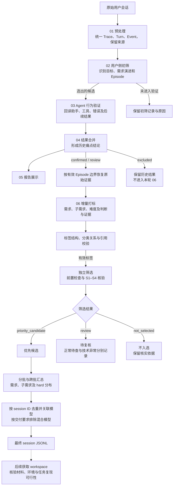
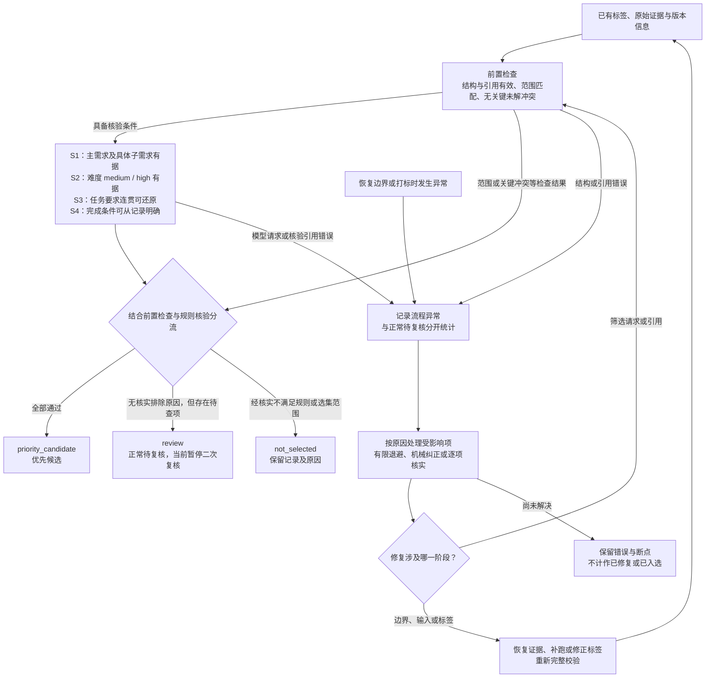

# 当前 Trace 筛选方案与四批次执行记录

本方案直接承接《06阶段基于已有标签的Trace筛选方案_20260917.md》的 `stage06-selection-v3`，保留其输入范围、信息依据、S1–S4 核验与三类分流规则，并补入实际来源、运行进度、修复记录、交付产物与分布统计。它不是另起一套筛选标准，也不把历史草案中已停用的四 gate 或整体质量等级恢复为门槛。

核查时间：**2026-09-21T15:06:05+08:00（Asia/Hong_Kong）**。进度依据本次读取的落盘文件；首次筛选综合报告生成于 **2026-09-20 10:19:43 +08:00**，随后补充 hard、模型字段和单模型交付清单。日期不同代表核查时间与产物快照时间不同，本次文档整理未启动模型请求、补跑、二次复核或改写正式结果。

原始方案与批次产物均位于本地 `docs/高质量Trace筛选_20260915/`；本文中指向这些材料的链接供本地审阅，原始数据和运行报告不随代码上传 GitHub。当前修订先保存在本地，用户确认前不提交、推送或更新 PR。

## 1. 目标、范围与术语

目标是从已有标签及其关联原始交互中，筛选值得索取 workspace、进一步评估任务构造价值的 Trace。主要考虑需求是否有据、任务是否有实质挑战、要求能否连贯还原、完成条件能否明确。优先候选不是已完成的 Benchmark 题目，也不表示 Agent 执行成功、任务已人工验收或 workspace 已可复现。

当前四批都复用 04 阶段 `confirmed/review` 候选，`excluded` 不进入本轮 06；不因增加标签、筛选和报告而重跑 01–04。历史痛点 confirmed 不加分，review 不因归因尚未确定而自动排除；通用候选不要求历史任务失败。如果将来扩大来源或单做痛点专题，需要另行说明入口和筛选条件。

原始 session 是会话，Trace 是分析轨迹，Episode 是围绕同一目标的任务片段。当前以 Episode 为主要打标和筛选单元，再按原始 session ID 导出会话清单；同一 session 中不同任务不会被自动删除。内部 case、episode、turn、event 标识用于关联，不能冒充原始数据提供方的 ID。所有下述“案例数”均为 Episode 案例数，“会话数”均单列去重范围。

新版不新增 task_constructability、task_reproducibility 或材料可用性标签；科研活动由需求与子需求表达，不恢复独立科研阶段、任务依赖或原子能力标签。外部材料完整性原属 S5，已后移到 workspace 获取之后，不能改名塞回 S3 或 S4。

## 2. 总体流程与执行入口

01 统一原始事件并保留来源，02 只看真实用户消息完成目标和 Episode 初筛，03 对候选回读助手、工具、错误与必要后续结果进行验证，04 合并历史痛点判断，05 展示这些结果。06 从 04 与原始证据独立增量打标，之后再执行 S1–S4 筛选。05 不是 06 的输入依赖；已有前置产物可以复用。

当前新版打标入口是 `python -m trace_analysis.pipeline.stage_06_trace_quality_labeling.relabel`，独立筛选入口是 `python -m trace_analysis pipeline select`。历史 `pipeline label` 仍输出旧 v5 结构，不能把旧标签直接当成新版输入；筛选不会重新执行整套语义打标。默认对缺失的 S3–S4 核验调用模型，`--rules-only` 跳过模型调用后，缺失的核验仍是 pending。

打标以用户提出或明确采纳的具体要求为依据，同时提供 User、Assistant、Tool 上下文解释指代和承接关系，不将 Agent 自选操作升级为用户需求。在一次主要打标请求中先识别需求，再粗配父需求、细配子需求并查表核对关系。长输入可能先做索引取证，失败可能有纠错请求；这不等于为每个需求固定增加一次调用。任务是否完成与需求是否成立分别判断。

## 3. 四批来源、采用版本与运行进度

### 3.1 来源清单

批次顺序沿用实际工作中的称呼，不按日期排序。输入统一位于 `workspace/analysis-runs/{batch_id}/{run_id}/04_results/pain_cases__{batch_id}__{run_id}.jsonl`。下表按文件实际记录数统计，不能把全文件条数和本轮 confirmed/review 入口条数混用。

| 批次 | batch_id | 采用的 run_id | 04 全量 | confirmed | review | excluded | 06 入口 |
| --- | --- | --- | --- | --- | --- | --- | --- |
| 第一批 20260813 | batch_20260813_192525_e45d808e | run_20260819_101745_38621ee3 | 22 | 12 | 2 | 8 | 14 |
| 第二批（Wisland） 20260828 | batch_20260828_162718_1dd984cc | run_20260828_164200_wisland_v1 | 173 | 75 | 6 | 92 | 81 |
| 第三批 20260820 | batch_20260820_183932_0042242a | run_20260822_episode_boundary_corrected_v4 | 436 | 265 | 16 | 155 | 281 |
| 第四批 20260822 | batch_20260822_184756_50ad9a83 | run_20260822_222726_7af71bbc | 1673 | 844 | 97 | 732 | 941 |
| 合计 | — | — | 2304 | 1196 | 121 | 987 | 1317 |

第三批使用 `run_20260822_episode_boundary_corrected_v4`。原方案记录已核对其 03、04 来源链和 22 条 Trace 的边界替换；该版本仍有 12 条无效边界，第四批仍有 46 条。来源链和起止位置校验不等于语义边界已经逐例人工审定；不得用零散引用的最小、最大位置猜测边界，也不把跨批相同 session 的不同归档路径当成相同文件内容。

### 3.2 首次筛选报告固定采用的版本

各批的打标基础目录均为 `workspace/analysis-runs/{batch_id}/{run_id}/06_trace_quality_labeling/trace-label-selection-v6-20260917/`。以下筛选目录均相对于该基础目录；不要仅按目录修改时间或 `latest_selection.json` 替换报告输入。

| 批次 | 报告采用的筛选目录 | 版本说明 |
| --- | --- | --- |
| 20260813 | selection-v7-trace-first-20260918-r01 | 该批首次筛选完成版 |
| 20260828 | selection-v7-trace-first-20260918 | Wisland 首次筛选版 |
| 20260820 | selection-242-20260920/selection-final | 242 条有效标签全部筛选；包含后补的 59 条 |
| 20260822 | merged-repairs-20260920/selection-final | 10 条筛选技术错误逐项处理后的合并版 |

### 3.3 运行进度清单

“首次筛选完成”在这里指已有有效标签均得到筛选结果，包括补筛和技术错误修复后的结果，不是只取第一次 API 调用，也不表示所有入口案例均已成功打标。下表以固定首次筛选报告口径拆分正常待复核和流程异常。

| 批次 | 入口案例 | 有效标签及其筛选已完成 | 优先候选 | 正常待复核 | 打标失败 | 边界异常 | 候选去重会话 | hard 案例 |
| --- | --- | --- | --- | --- | --- | --- | --- | --- |
| 20260813 | 14 | 14 | 10 | 4 | 0 | 0 | 10 | 6 |
| 20260828 | 81 | 81 | 43 | 38 | 0 | 0 | 43 | 11 |
| 20260820 | 281 | 242 | 167 | 75 | 27 | 12 | 150 | 55 |
| 20260822 | 941 | 799 | 560 | 239 | 96 | 46 | 472 | 188 |
| 合计 | 1317 | 1136 | 780 | 356 | 123 | 58 | 672（跨批去重） | 260 |

| 批次 | 实际 selection.jsonl 行数 | 其中 review 行数 | 其中流程异常占位 | 筛选模型技术错误未解决 | 当前工作状态 |
| --- | --- | --- | --- | --- | --- |
| 20260813 | 14 | 4 | 0 | 0 | 有效标签筛选完成；无遗留打标/边界异常 |
| 20260828 | 81 | 38 | 0 | 0 | 有效标签筛选完成；无遗留打标/边界异常 |
| 20260820 | 242 | 75 | 0 | 0 | 有效标签筛选完成；剩余打标/边界异常待处理 |
| 20260822 | 941 | 381 | 142 | 0 | 有效标签筛选完成；剩余打标/边界异常待处理 |

第四批的筛选文件包含全部 941 条入口记录，381 条 review 中有 96 条打标失败、46 条边界异常，正常待复核实际是 239 条。第三批首次筛选文件只包含 242 条有效标签，另外 39 条异常单独保留，因此不能直接把四个筛选文件中的 review 行数相加称为“正常待复核”。总体满足 **1,317 = 780 优先候选 + 356 正常待复核 + 123 打标失败 + 58 边界异常**；当前这些正式首次筛选快照没有 not_selected 条目，三类结果定义本身仍保留。

进度以已成功标签、按案例取最后一条错误并排除已成功项、异常 kind 及正式筛选结果共同核对。`failed_this_invocation` 只表示单次调用失败数，例如第三批进度文件记 26，但总遗留打标失败为 27；第四批 `input_issues.jsonl` 有 142 行，其中只有 46 行为边界问题。旧 `batch_pause.json`、启动时状态和历史 PID 不单独用来推断当前正在运行。

### 3.4 后续复核版本与暂停状态

第三批后来进行了局部需求依据、完成条件及已发生失败的复核，最新指针落在 `review-observed-failures-20260920/selection-final`，结果为 **172 优先候选、70 正常待复核、153 个候选会话**。其相对首次筛选新增的 5 条不纳入本报告的 167 条，也不纳入跨批 780 条或最终 779 条清单。若直接将各批最新正式候选相加会得到 785 条、正常待复核 351 条，这只是另一个范围，不能替换已冻结的首次筛选交付结果。

第三批 `review-remaining-70-20260920/status.json` 为 `paused_scope_changed_by_user`，记录已处理 45/70 条（34 条提案、11 条技术错误），`automatic_apply=false`。这些是未应用的复核工作记录，不能算新增入选，11 条也不另加到首次筛选的 181 条流程异常。当前优先处理首次流程异常，正常待复核的集中二次复核保持暂停。

## 4. 使用哪些已有信息

| 信息 | 筛选作用 |
|---|---|
| 需求点、子需求点、mapping_status | 判断是否有明确核心科研任务 |
| 具体要求、初始目标、约束、需求演进、用户反馈 | 判断目标能否还原、需求是否属于同一任务 |
| 整体 difficulty、五维难度及理由 | 判断是否存在实质性挑战，解释难度来源 |
| 逐标签证据支持状态及实际复核记录 | 检查关键分类和难度判断是否可信 |
| 上述标签关联的用户原文、操作、代码、配置、测试、指标及结果 | 判断任务要求和完成条件是否明确 |
| 工作对象、领域 | 按选集目的限定范围或控制覆盖，不直接加质量分 |
| 历史 pain_judgment、失败模式 | 痛点专题筛选或案例解释；通用构题候选不要求历史失败 |

初标自述 supported 不代表已完成复核。报告区分模型筛选与人工核验；人工核验范围必须实际覆盖本次入选所依赖的标签和筛选证据。

读取时须区分三个编号层次：案例内具体需求 ID 标识“用户要做什么”；claim_id 标识对某字段的判断、理由与支持状态；evidence_id 标识可以回查原文的证据。筛选理由通过这些关联回到事件、角色、引文、Turn、来源文件和 Episode 范围，不能用一个存在但无关的编号填补引用。`labels.review_view` 是将这些关联展开为可读内容的展示层，不另行产生标签真值。

保留真实逐标签复核的模型或人工身份、审核时间、覆盖范围和标签摘要。supported 是模型初标的依据判断，只有存在实际复核记录时才说明复核范围；不能把模型核验或程序检查改称人工审核。

## 5. 四项筛选规则

这些是最终筛选的审核项目，不是新增一组模型语义标签。每项结果在 selection 记录中引用已有 claim/evidence，说明通过、待查或不满足的原因，不重复提取标签；缺失的S3–S4筛选判断由模型读取既有标签及原文完成。

下列字段路径以 `model_output` 为根，正式 label 文件中需加 `model_output.` 前缀；这些是新版06 schema 已有定义，不代表历史v3/v5已包含全部字段。各项按 `claim_ids` 或 `claims[].field_path`、`claims[].target_id` 关联主张，再通过 evidence_ids 核对 `evidence_refs[]` 的原文、角色、定位与范围。已有实际复核时，通过 `review_record_paths` 读取对应版本的 `claim_reviews[]`；初标 supported 不代替实际复核。缺口和冲突结合 `claims[].missing_evidence_queries`、`claims[].conflicting_evidence_ids`、`limitations[]` 检查，字段为空不代表没有缺口。

### S1：主需求及具体子需求成立

- 至少一个 req_001–req_033 父需求有依据；req_034–req_036 只能辅助。
- 优先入选还须有该范围内至少一个子需求明确匹配，且该映射的证据支持状态为 supported。
- 只知父级：父级准入可以成立，但具体子需求未明，进入待复核。不要混淆 mapping_status=partial 与证据支持状态 partial。
- 核验后仅有辅助需求、明确无前33类主需求：本轮不入选。
- 若仅因记录没读到而无法确定主需求：待复核，不以没有找到代替不存在。
- 不强行补主需求。移除 unsupported 映射后，重新判断是否仍有有效主需求。

### S2：任务有实质性挑战

- difficulty=medium/high 且该难度判断证据 supported：通过。
- difficulty=unknown，或难度依据 partial/unknown：待复核。
- 难度误判或证据 unsupported：先修正，再筛选，不能用错误标签直接淘汰原始 Trace。
- 核验后 difficulty=low：本轮不入选优先池，保留为简单题备选；不称其为低质量原始记录。
- 五维用于解释难度，不求和，不以 high 自动压过 medium。需求演进/外部信息须确实增加挑战，长度、工具数量和时长不单独证明难度。

### S3：能还原连贯的任务要求

**使用的已有标签/字段：**

- `assessment_target.goal`：核心目标；`assessment_target.core_requirement_ids`、`assessment_target.noncore_requirement_ids`：核心与非核心要求范围；`assessment_target.boundary_status`：任务边界是否明确。
- `case_requirements[].text`、`case_requirements[].origin`、`case_requirements[].is_core`：具体要求、要求来源及核心性。约束在要求文本及关联原文中核对，没有独立的 constraints 字段。
- `feedback_annotations[].type`、`feedback_annotations[].target_requirement_ids`：区分补充初始规格、纠正、目标变化和自然深化，并关联到具体要求。
- `task_attributes.work_object_primary`、`task_attributes.work_object_secondary`：辅助识别对象类别；具体数据、代码或实验实例仍须从要求和原文确定。
- 上述字段对应的 `claims[].support_status`、`claims[].evidence_ids` 及 `evidence_refs[]`：核对目标、要求和边界的依据；结合原始事件确定先后顺序，origin 不代表精确时间。

**筛选规则：**

- 目标、对象、具体要求和有效约束能从同一任务的记录中连贯还原，边界清楚且有证据支持：通过。不能只因 goal/text 非空或 boundary_status=confirmed 就自动通过。
- 初始 Query 不清楚但后续已澄清，可以通过；在理由中说明采用的任务范围。后续新增要求不能倒推成此前 Agent 应满足的约束。
- 需要补读、消除指代或确认边界：待复核。
- 完整核验后仍只有泛泛活动描述，或只能拼接不同目标才能形成任务：本轮不入选。
- 局部任务可用时以 case_requirement 模式明确选取范围；局部难度不能直接复制整体难度。

### S4：完成条件可从已有记录明确

**使用的已有标签/字段：**

- `case_requirements[].text`：已记录的输出要求、约束和验收表述；`assessment_target.goal`、`assessment_target.core_requirement_ids`：确认完成条件对应的目标及核心要求。
- `feedback_annotations[].type`、`feedback_annotations[].requirement_evidence_ids`、`feedback_annotations[].prior_output_evidence_ids`、`feedback_annotations[].evidence_id`：定位用户要求、相关输出和针对结果的具体反馈。
- `task_attributes.difficulty_dimensions.verification_burden` 及其 claim：辅助定位验证难点；难度等级不证明验收标准已经明确。
- 上述字段对应的 `claims[].support_status`、`claims[].evidence_ids` 及 `evidence_refs[]`：核对原文中的测试、期望输出、指标阈值、对照协议或其他可核对的完成标准。现有 schema 没有独立的 acceptance_criteria 字段。

**筛选规则：**

- 能依据已有要求和原文指出何种结果算满足任务：通过。例如保持接口不变并通过指定回归测试，或按明确协议输出可核对的统计结果。
- 反馈类型为 acknowledgement、助手声称完成、用户一句“好”，均不足以单独通过；必须核对反馈的具体内容。verification_burden 有据也不等于完成条件有据。
- 分类表的通用“预期输出/验收要点”不能替用户发明此案例的验收标准。历史任务失败不影响其完成条件明确。
- 需要补证才能确认：待复核。
- 完整核验后无法确定任何合理完成依据：本轮不入选。

### 外部材料检查后移（旧 S5 不再参与当前筛选）

当前使用用户与 Agent 的 Trace 寻找值得进一步核验的任务，再按 session ID 索取对应 workspace。是否拥有完整文件、起始版本、数据、配置与运行环境，不作为当前优先候选或待复核的分界；取得 workspace 后再判断实际任务构造与复现可行性。

不将旧 S5 伪记为 pass；新版 rule_checks 仅包含 S1–S4。环境与工具、工作流依赖的难度标签保留，未新增可用性或可复现性标签。不能把材料是否可取得的问题转移到 S3/S4；任务目标或完成标准本身不明确仍需待复核。

### 筛选证据与初始标签证据的关系

初始 claim 的 evidence_ids 用于证明对应标签；筛选核验可同时引用同一案例 evidence_refs 中其他已验证的原文证据，不要求这些证据预先挂在所选 claim 下。程序仍检查案例、ID、引文逐字匹配、角色、位置和 Episode 边界；模型或实际审核者须在 reason 中说明证据如何支持本条筛选规则，证据 ID 存在不等于语义支持。

pass/fail 仍须引用当前范围内有支持且无冲突的已有 claim；不存在的 ID、跨案例引用和无效引文仍拒收。不得为通过格式检查而添加无关 claim。

## 6. 分流、范围与去重

先检查输入、标签与引用有效性。格式错误、角色错配、非法分类等进入修正/待复核，不能当成 Trace 质量差。关键标签 unsupported 先修正；不相关的可选标签问题不一律阻断有效任务。

在标签有效基础上执行 S1–S4：

| 决定 | 条件 |
|---|---|
| 优先入选 priority_candidate | 本轮范围匹配，S1–S4 均有依据通过，无影响入选的未决冲突 |
| 待复核 review | 没有已确认的排除原因，但至少一项信息未明、证据不足或需修正 |
| 本轮不入选 not_selected | 已确认仅辅助需求、难度low、目标无法还原、完成条件无法确定，或不符合本轮明确范围 |

已确认的排除原因优先于其他未知项，但只有经过核验的标签/事实可用于排除。保存全部原因和证据，不删除原始案例。

另保存执行筛选者类型 model/human 和复核引用，这是操作元数据，不新增任务属性标签。priority_candidate 可由模型辅助筛选产生，但未经过实际人工核验时不得称“人工确认高质量”。

没有充分证据检查 S3–S4 时，只能进入待复核；不能因为前两项自动过滤通过就默认优先入选。

### 范围、数量与去重

- 默认不限定八大学科或工作对象。代码/实验专题可配置相应工作对象及需求范围；对象标签本身也需要支持。
- 不设匹配需求数量硬上限。超过5父需求或10子需求的复核阈值仍为未启用建议，不自动截断。
- 优先池内按需求、工作对象、领域和难度分布选取；没有用户指定容量时不强行取前N，不用综合总分排序。
- 同一session含不同任务，不自动去重；相同目标/范围的重复候选核验后合并展示并保留全部来源。
- 如另做痛点专题，可加 historical confirmed 与对应需求的具体失败证据条件，不改变通用构题方案。

## 7. 修复机制、完成记录与剩余问题

修复必须区分“规则或代码已接入”“某个案例已修复并重新筛选”“剩余案例已经补跑完成”。三者不能互相替代。技术异常按原因保留，不以坏标签直接判原始 Trace 不入选；修复后仍按前置检查和 S1–S4 分流。下图中的循环表示有边界的针对性处理，不是无限自动重试；S1–S4 也不是四次固定的模型调用。

### 7.1 已接入正式流程的通用修复

| 问题与原因 | 生成时约束或运行策略 | 程序处理与边界 |
| --- | --- | --- |
| 模型将需求 ID 写进数组字段路径 | 明确数组路径使用实际零基下标，需求 ID 放 target_id | 仅在 ID 唯一、归属一致、字段存在时转换，保存 serialization_resolutions；不猜重复 ID 或越界下标 |
| 筛选时混用具体需求编号与判断编号 | 提供 claim 目录、需求文本和用途说明 | 只纠正唯一、范围内、有支持且无冲突的 claim 引用；保留原规则判断并记录 reference_resolutions |
| 筛选引用原文存在但未登记的证据 | 提交完整 event_id 和连续逐字 quote，不生成猜测编号 | 核对实际提供的正文、角色、定位和 Episode 归属后登记到 audit.additional_evidence_refs；初标及其摘要保持不变 |
| 原事件编号被填入 evidence_id | 优先选择证据目录中的 evidence_id | 只在完整 event_id 唯一对应一条已登记证据时转换，不匹配前缀、不用无关证据填空 |
| 证据角色、Turn、位置或引文不一致 | 强调连续原文及真实来源 | 仅可精确证明的定位或 JSON 转义差异做机械纠正；改写、越界和歧义继续报错或补证 |
| 父子需求不一致，或把未完成误判为需求无依据 | 同一次打标先识别用户要求、再父类粗配与子类细配；区分需求、来源、核心性和完成状态 | 分类关系校验继续执行，不自动改父类或提升支持状态；既有 partial/unresolved 语义保留 |
| 503 服务暂不可用 | 启用 TRACE_ANALYSIS_503_BACKOFF=1 | 初次请求后最多追加 3 次，约 15/45/120 秒并浮动；连续 5 次失败冷却 180 秒后单次探测，请求预算持久化，外层重跑不清零 |
| 长输入超过本地字符或模型 token 上限 | 保留原始证据、显式记录已读范围；适用时索引取证 | 不静默截断；已有标签核验的索引经验不能直接等同于无标签的首次打标方案 |

以上修改不新增固定的逐需求分类调用链。历史接入记录包含 125 项相关测试及 6 条真实案例离线回放通过；本次代码同步时完整代码测试为 178 项通过。它们验证代码行为和历史修复兼容性，不代表新 Prompt 已在剩余 123 条失败案例上完成补跑。

### 7.2 第四批 10 条筛选技术错误的实际处理

下面的数字是第四批原 Stage04 输入的物理行号，需与该批次和 run 一起定位，不能当作跨批通用案例 ID。原始快照保留，修复结果已合入 `merged-repairs-20260920`。

| 输入行号 | 问题 | 实际处理 | 合并后结果 |
| --- | --- | --- | --- |
| 103、698 | 具体需求编号误当 claim_id | 唯一受支持判断匹配后修正 7 处引用，不改变原审核语义 | 103 优先候选；698 待复核 |
| 762、461、1199、1209 | 原文存在但证据未登记 | 在派生标签中登记 5 条真实证据，重新绑定核验摘要；461 区分助手命令与工具结果 | 762、1209 优先候选；461、1199 待复核 |
| 975 | 读取 PDF 失败被用于怀疑用户要求本身 | 对照用户“使用四份 PDF”等原话拆清需求及依据，保留执行失败事实，完成 Codex 本地模型复核 | 优先候选 |
| 287 | 用户要纯 Markdown 与是否成功交付混在同一判断 | 收准为需求文字证据，保留完成情况和其他部分支持问题 | 待复核 |
| 210 | 可行性讨论被理解为已要求执行真实实验 | 收准任务范围，S3 通过；咨询完成条件仍待查，不发明实验阈值 | 待复核 |
| 151 | 筛选核验上下文超限 | 保留全部已提供用户/助手事件、引用和关键检查；32 块未引用工具文档正文转可追溯索引 | 请求成功，S3/S4 通过；领域判断仍为部分支持，保持待复核 |

这 10 条全部消除了原筛选技术错误，但最终只有 4 条进入优先候选，6 条仍待复核；第四批由 556 优先候选变为 560，不能把“技术修复成功”直接记为“筛选通过”。这些个案中的语义调整并未变成全局自动补丁。151 的请求由约 54.4 万字符降至 22.5 万字符，是已有标签核验个案，不是完整文档重读，也不是所有长输入问题已经解决。

### 7.3 仍待补跑的 123 条打标失败

以下按 `label_errors.jsonl` 对每个 case_id 取最后一条错误，再剔除已有成功标签的案例；最后错误类型用于排队，不保证就是唯一根因。

| 最后错误类别 | 第三批 0820 | 第四批 0822 | 合计 |
| --- | --- | --- | --- |
| 模型上下文 token 超限 | 10 | 45 | 55 |
| 本地输入字符超限 | 4 | 17 | 21 |
| 字段路径或数组引用错误 | 5 | 16 | 21 |
| 证据定位、引文或登记问题 | 4 | 13 | 17 |
| 父子需求不匹配 | 1 | 1 | 2 |
| 请求超时 | 2 | 4 | 6 |
| 503 服务错误 | 1 | 0 | 1 |
| 合计 | 27 | 96 | 123 |

另外还有 **58 条边界异常（第三批 12、第四批 46）**，合计 181 条首次流程异常，未因通用修复接入而自动消失。本地字符上限发生在请求发送前，模型 token 上限发生在服务端按输入与输出预算检查时，两者单位和触发位置不同；不能只提高一个参数就宣称全部解决。21 条路径错误中有 20 条需求 ID 路径错误和 1 条数字下标越界；17 条证据问题也并非都满足机械修复条件。

处理顺序是先针对受影响项验证现有修复能否恢复有效标签，再处理需要语义判断的父子关系和证据问题，继续细化长输入方案，随后恢复边界异常并补打标。新有效标签进入正常首次筛选，新增候选才纳入新版本汇总。未经实际验证，不把已有成功标签覆盖、不把未解决项删掉，也不恢复正常待复核的集中二次复核。

## 8. 输出产物与结果读取

### 8.1 机器产物

| 产物 | 作用与读取原则 |
| --- | --- |
| labels.jsonl | 有效标签；与原文证据分开保存，每项判断保留支持状态 |
| evidence.jsonl | 按案例关联的真实事件、角色、引文、定位及实际提供正文的范围 |
| sources.jsonl | 案例到来源行、原始 session、模型及来源记录的关联 |
| labeling_manifest.json、source_validation.json | 输入摘要、规则/模型/程序版本、边界与来源校验范围 |
| labeling_progress.json、label_errors.jsonl、input_issues.jsonl | 单次进度、失败历史与输入异常；按案例去重并结合 kind 解读 |
| selection.jsonl | 每个筛选对象的 S1–S4、前置检查、决定、理由、标签和政策摘要 |
| model_selection_audits.jsonl、model_review_log.jsonl | 实际模型核验与调用/纠错记录；修复证据和来源可追溯 |
| selection_checkpoint.jsonl、selection_summary.json | 断点与完成汇总，报告和导出路径、数量、摘要 |
| latest_selection.json | 某批后续正式版本的指针；不自动替换冻结综合报告的来源 |

以上位于 `workspace/analysis-runs/` 的对应 batch/run/标签版本目录。模型核验记录中的 claim/evidence 引用须属于同一案例和评价范围，且原文匹配只是必要条件，仍需语义支持。初标证据用于支持标签，筛选也可引用该案例中其他已核实证据；真正登记的新证据须保存来源，不得随手补编号通过格式检查。

### 8.2 报告与交付清单

所有供审阅的报告、需求分布、修复对照及会话清单统一放在 `docs/高质量Trace筛选_20260915/`。单批目录遵循 `batch-reports/{batch}/{run}/06_trace_quality_labeling/{label_run}/{snapshot}/`，跨批快照位于 `selection-summaries/`；机器目录旧报告路径可能是兼容链接。

| 批次 | 首次筛选报告 |
| --- | --- |
| 20260813 | [查看该批报告](<高质量Trace筛选_20260915/batch-reports/batch_20260813_192525_e45d808e/run_20260819_101745_38621ee3/06_trace_quality_labeling/trace-label-selection-v6-20260917/06阶段标签质量与分布审查报告.md>) |
| 20260828 | [查看该批报告](<高质量Trace筛选_20260915/batch-reports/batch_20260828_162718_1dd984cc/run_20260828_164200_wisland_v1/06_trace_quality_labeling/trace-label-selection-v6-20260917/06阶段标签质量与分布审查报告.md>) |
| 20260820 | [查看该批报告](<高质量Trace筛选_20260915/batch-reports/batch_20260820_183932_0042242a/run_20260822_episode_boundary_corrected_v4/06_trace_quality_labeling/trace-label-selection-v6-20260917/selection-242-20260920/06阶段标签质量与分布审查报告.md>) |
| 20260822 | [查看该批报告](<高质量Trace筛选_20260915/batch-reports/batch_20260822_184756_50ad9a83/run_20260822_222726_7af71bbc/06_trace_quality_labeling/trace-label-selection-v6-20260917/merged-repairs-20260920/06阶段标签质量与分布审查报告.md>) |

本次跨批快照目录为 `docs/高质量Trace筛选_20260915/selection-summaries/four-batch-first-selection-780-20260920/`。其中包含 [综合报告](<高质量Trace筛选_20260915/selection-summaries/four-batch-first-selection-780-20260920/四批次首次筛选优先候选综合报告.md>)、[批次统计](<高质量Trace筛选_20260915/selection-summaries/four-batch-first-selection-780-20260920/批次统计.csv>)、[候选案例清单](<高质量Trace筛选_20260915/selection-summaries/four-batch-first-selection-780-20260920/优先候选案例清单.csv>)、[hard 案例清单](<高质量Trace筛选_20260915/selection-summaries/four-batch-first-selection-780-20260920/hard优先候选案例清单.csv>)、[需求分布](<高质量Trace筛选_20260915/selection-summaries/four-batch-first-selection-780-20260920/需求点分布.csv>)、[子需求分布](<高质量Trace筛选_20260915/selection-summaries/four-batch-first-selection-780-20260920/子需求点分布.csv>)、[统计 JSON](<高质量Trace筛选_20260915/selection-summaries/four-batch-first-selection-780-20260920/统计数据.json>) 和 [来源及文件摘要清单](<高质量Trace筛选_20260915/selection-summaries/four-batch-first-selection-780-20260920/manifest.json>)。

原四字段 session JSONL 每行提供 `session_id`、`session_jsonl_path`、`workspace_path`、`case_ids`。带模型版本额外提供标准化单值 `model`、完整列表 `models` 和原始标识 `raw_models`；混合模型的 model 为 mixed，不强行归到其中一个模型。模型信息来自 sources 的原始来源字段，通过案例和 session 核对关联，不由标签内容猜测。

跨批以原始 session ID 去重；3 个重复会话的不同归档路径在 `优先候选会话清单.jsonl` 的 source_locations 中全部保留，兼容四字段导出选择一个可用路径。同一会话对应的不同案例保留，别名归一仅用于模型家族展示，不证明模型快照完全相同。

| 用途 | 数量口径 | 文件 |
| --- | --- | --- |
| 四批带模型总清单 | 780 案例 / 672 会话 | [首次筛选含模型 JSONL](<高质量Trace筛选_20260915/selection-summaries/four-batch-first-selection-780-20260920/session_paths__priority_candidate__four_batches_first_selection_780_with_models.jsonl>) |
| 最终单模型交付 | 779 案例 / 671 会话 | [排除混合模型后的最终 JSONL](<高质量Trace筛选_20260915/selection-summaries/four-batch-first-selection-780-20260920/session_paths__priority_candidate__four_batches_final_single_model_671.jsonl>) |
| 20260813 单批带模型清单 | 10 会话 | [20260813 JSONL](<高质量Trace筛选_20260915/selection-summaries/four-batch-first-selection-780-20260920/session_paths__priority_candidate__20260813_with_models.jsonl>) |
| 20260828 单批带模型清单 | 43 会话 | [20260828 JSONL](<高质量Trace筛选_20260915/selection-summaries/four-batch-first-selection-780-20260920/session_paths__priority_candidate__20260828_with_models.jsonl>) |
| 20260820 单批带模型清单 | 150 会话 | [20260820 JSONL](<高质量Trace筛选_20260915/selection-summaries/four-batch-first-selection-780-20260920/session_paths__priority_candidate__20260820_with_models.jsonl>) |
| 20260822 单批带模型清单 | 472 会话 | [20260822 JSONL](<高质量Trace筛选_20260915/selection-summaries/four-batch-first-selection-780-20260920/session_paths__priority_candidate__20260822_with_models.jsonl>) |

四份单批 with_models 文件仍是首次筛选原范围，Wisland 文件仍含那一个混合模型会话；排除混合模型的用户要求应用于最终跨批单模型交付文件，没有反向覆盖原报告和冻结单批清单。

## 9. 输出结果与分布统计

### 9.1 三种结果口径

这里明确区分首次筛选报告、最终单模型交付，以及后来局部复核的版本。以下 779 条统计是本次从最终清单的 case_ids 关联同一批原标签、筛选结果后进行的本地确定性重算，没有调用模型，也没有覆盖原 780 条报告、CSV 或 manifest。

| 口径 | 候选案例 | 去重会话 | hard 案例 | 用途 |
| --- | --- | --- | --- | --- |
| 冻结首次筛选报告 | 780 | 672 | 260 | 包含补筛与技术修复；排除正常二次复核新增 |
| 最终单模型交付 | 779 | 671 | 260 | 在上项基础上排除 1 个 mixed 会话及其 1 条案例 |
| 各批最新正式候选数相加 | 785 | 本方案不另作该范围的跨批去重 | 本方案不统计 | 含第三批局部复核新增 5 条；不替代前两项 |

排除的案例为 `episode_ceb3e936e2ce926999fafe8a__line_15`，对应会话 `1b1b6b34-9fef-4e7c-bef5-ed85ab6f5f91`，来自 Wisland，混合使用 Claude Opus 4.8 与 DeepSeek V4 Pro。混合模型排除是交付范围过滤，不是重新将其 S1–S4 判为不通过。

### 9.2 难度及覆盖总览

| 指标 | 报告 780 条 | 最终交付 779 条 |
| --- | --- | --- |
| medium 案例 | 520 | 519 |
| high / hard 案例 | 260 | 260 |
| hard 占候选比例 | 33.33% | 33.38% |
| 涉及 hard 案例的去重会话 | 232 | 232 |
| 覆盖主需求 | 33/33 | 33/33 |
| 覆盖全部需求 | 34/36 | 34/36 |
| 覆盖子需求 | 171/216 | 171/216 |
| hard 覆盖子需求 | 155 | 155 |
| 计入明确覆盖的映射记录 | 4345 | 4342 |
| 未计入明确覆盖的映射记录 | 83 | 82 |

| 批次 | 首次优先候选 | hard | hard 占本批候选 |
| --- | --- | --- | --- |
| 20260813 | 10 | 6 | 60.00% |
| 20260828 | 43 | 11 | 25.58% |
| 20260820 | 167 | 55 | 32.93% |
| 20260822 | 560 | 188 | 33.57% |

hard 仅表示现有整体 difficulty=high，不是新增评判模式，也不是把整个 session 统一定为 hard。同一会话可包含不同难度案例，不能拿会话比例和案例比例混比。

### 9.3 候选会话的模型分布

本表按入选会话统计，不是四批全部输入 Trace 的模型分布。单批数字对应原 with_models 清单，四批相加为 675 个会话，跨批去重为 672，其中 3 个重复会话属于 Claude Opus 4.6；mixed 单独计数，不重复计入两个模型行。最后一列才是排除 mixed 后的 671 个会话。

| 模型 | 0813 | 0828 | 0820 | 0822 | 跨批 672 会话 | 最终 671 会话 |
| --- | --- | --- | --- | --- | --- | --- |
| DeepSeek V4 Pro | 5 | 27 | 114 | 285 | 430 | 430 |
| Qwen 3.7 Plus | 0 | 0 | 0 | 148 | 148 | 148 |
| Claude Opus 4.6 | 5 | 1 | 36 | 0 | 40 | 40 |
| Qwen 3.7 Max | 0 | 0 | 0 | 39 | 39 | 39 |
| Claude Opus 4.8 | 0 | 14 | 0 | 0 | 14 | 14 |
| mixed | 0 | 1 | 0 | 0 | 1 | 0 |
| 合计 | 10 | 43 | 150 | 472 | 672 | 671 |

### 9.4 研究领域与工作对象分布

以下均按候选案例计数。领域表示研究对象，工作对象表示任务要处理的对象，不因出现代码就把领域定为计算机；unknown 是已有标签中的未确定领域。本次只统计原标签，不重判语义。

#### 主要研究领域

| 类别 | 报告 780 条 | 报告占比 | 最终交付 779 条 |
| --- | --- | --- | --- |
| 生物 | 233 | 29.87% | 233 |
| 计算机 | 165 | 21.15% | 165 |
| 工科 | 163 | 20.90% | 162 |
| unknown | 79 | 10.13% | 79 |
| 物理 | 52 | 6.67% | 52 |
| 材料 | 41 | 5.26% | 41 |
| 环境 | 22 | 2.82% | 22 |
| 化学 | 19 | 2.44% | 19 |
| 数学 | 6 | 0.77% | 6 |

#### 主要工作对象

| 类别 | 报告 780 条 | 报告占比 | 最终交付 779 条 |
| --- | --- | --- | --- |
| 论文 | 412 | 52.82% | 411 |
| 文献与外部证据 | 162 | 20.77% | 162 |
| 研究方案 | 60 | 7.69% | 60 |
| 代码 | 59 | 7.56% | 59 |
| 数据 | 36 | 4.62% | 36 |
| 实验 | 31 | 3.97% | 31 |
| 科学问题 | 17 | 2.18% | 17 |
| 环境 | 3 | 0.38% | 3 |

### 9.5 需求与子需求分布的统计规则

仅统计分类关系合法、映射及其关联判断有支持证据且无冲突的记录；实际逐标签复核覆盖初标时沿用其有效结论。同一案例同一类别只计一次，一个案例可命中多个类别，各行不能加总当候选总数。父需求案例数取所含有效子需求案例集合的并集，不能累加子需求行。partial、unresolved 和缺乏支持的映射另外记录，不扩充明确覆盖，也不因此直接更改筛选结果。

下表按需求 ID 升序展示全部 36 类，hard 是该行案例中的 high 子集。报告口径的 CSV 原样保留；最后两列是本次最终 779 条范围重算。子需求完整 216 项放在附录 A，同样保留零覆盖项。明确覆盖不表示对应能力一定失败或已人工确认；零覆盖也不能直接解释为用户没有这种需求。

| 需求 ID | 需求 | 用途 | 报告案例 | 报告 hard | 覆盖子类 | 最终案例 | 最终 hard |
| --- | --- | --- | --- | --- | --- | --- | --- |
| req_001 | 文献调研 | 主需求 | 369 | 135 | 18 | 369 | 135 |
| req_002 | 问题定义 | 主需求 | 66 | 40 | 12 | 66 | 40 |
| req_003 | 资源估算 | 主需求 | 28 | 17 | 6 | 28 | 17 |
| req_004 | 实验设计 | 主需求 | 72 | 47 | 16 | 72 | 47 |
| req_005 | 环境配置 | 主需求 | 25 | 15 | 5 | 25 | 15 |
| req_006 | 资源获取 | 主需求 | 59 | 29 | 5 | 59 | 29 |
| req_007 | 数据解析 | 主需求 | 27 | 11 | 5 | 27 | 11 |
| req_008 | 数据预处理 | 主需求 | 38 | 20 | 6 | 38 | 20 |
| req_009 | 特征工程 | 主需求 | 13 | 9 | 4 | 13 | 9 |
| req_010 | 已有仓库代码理解 | 主需求 | 15 | 9 | 4 | 15 | 9 |
| req_011 | 代码框架设计 | 主需求 | 75 | 58 | 8 | 75 | 58 |
| req_012 | 算法组件实现 | 主需求 | 58 | 41 | 3 | 58 | 41 |
| req_013 | 代码更新管理 | 主需求 | 24 | 14 | 4 | 24 | 14 |
| req_014 | 代码测试 | 主需求 | 1 | 1 | 1 | 1 | 1 |
| req_015 | 方法评估 | 主需求 | 16 | 12 | 4 | 16 | 12 |
| req_016 | 实验配置 | 主需求 | 8 | 4 | 2 | 8 | 4 |
| req_017 | 任务执行调度 | 主需求 | 61 | 47 | 1 | 61 | 47 |
| req_018 | 任务管理监控 | 主需求 | 12 | 8 | 3 | 12 | 8 |
| req_019 | 实验状态诊断 | 主需求 | 39 | 34 | 8 | 39 | 34 |
| req_020 | 实验修复 | 主需求 | 19 | 15 | 4 | 19 | 15 |
| req_021 | 实验调优 | 主需求 | 17 | 17 | 3 | 17 | 17 |
| req_022 | 实验核验 | 主需求 | 10 | 6 | 3 | 10 | 6 |
| req_023 | 结果统计 | 主需求 | 15 | 4 | 3 | 15 | 4 |
| req_024 | 结果比较 | 主需求 | 11 | 9 | 3 | 11 | 9 |
| req_025 | 结果解释 | 主需求 | 26 | 18 | 6 | 26 | 18 |
| req_026 | 结果可视化 | 主需求 | 68 | 14 | 2 | 68 | 14 |
| req_027 | 规划论文结构 | 主需求 | 151 | 39 | 2 | 150 | 39 |
| req_028 | 撰写相关工作 | 主需求 | 206 | 40 | 3 | 206 | 40 |
| req_029 | 撰写方法实验章节 | 主需求 | 200 | 51 | 6 | 200 | 51 |
| req_030 | 编排图表 | 主需求 | 97 | 14 | 2 | 97 | 14 |
| req_031 | 论文修订 | 主需求 | 410 | 87 | 9 | 409 | 87 |
| req_032 | 回应审稿意见 | 主需求 | 26 | 9 | 2 | 26 | 9 |
| req_033 | 成果发布 | 主需求 | 113 | 31 | 6 | 112 | 31 |
| req_034 | 进度管理 | 辅助 | 9 | 5 | 2 | 9 | 5 |
| req_035 | 连续性维护 | 辅助 | 0 | 0 | 0 | 0 | 0 |
| req_036 | 风险管理 | 辅助 | 0 | 0 | 0 | 0 | 0 |

报告范围有 45 类子需求零覆盖、23 类仅 1 条案例覆盖；完整逐批贡献、比例与原 hard 分布可从原 CSV 和综合报告回查。后续子需求精简、零命中检索或补标提案是独立诊断，未经正式验证与应用，不改变这里的标签和分布。

## 10. 核验依据、版本约束与后续工作

本次已核对四批输入判定计数、成功标签集合、去重后的最后失败记录、边界异常 kind、各选定版本的决定数、入选标签摘要、候选与会话覆盖，并校验综合 manifest 中 **44 个来源或输出文件的 SHA-256**。重新聚合 780 条需求、子需求和 hard 分布与原 CSV 逐项一致，再按最终清单重算 779 条范围。文件哈希相同只说明版本一致，不代替语义审核或材料复现核验。

报告绑定的政策 SHA-256 为 `ed30b85113868d335fda90aad9321caa62765423eb8db87f966ceb7e2690231f`，分类表 SHA-256 为 `96bd11c79ff7de9cb7d096fc84c1b8d72404244a8d2561498e2199001e8bfd4a`。它们描述报告生成时的快照，不能假定当前所有 Prompt/schema 与历史运行完全相同。后续运行必须记录实际输入、模型、政策、schema、Prompt/程序版本、审核者与标签摘要；标签内容或规则语义变动后重新核验，不直接搬用旧审核。仅旧 S5 删除而 S1–S4 与标签完全一致的历史迁移，才可按显式迁移规则保留原结论与来源。

下一步优先处理 123 条打标失败和 58 条边界异常，补齐有效标签、完成首次筛选后再输出新快照，继续沿用最终交付排除混合模型的要求。正常待复核的二次复核暂不恢复。得到 workspace 后另行核查必要输入、起始代码与数据、版本环境、材料可得性和任务复现可行性，不在本轮 Trace 筛选中伪造材料完整或已可复现的结论。

原方案、支持设计与执行记录的关系如下：

| 材料 | 作用 |
| --- | --- |
| [06阶段基于已有标签的Trace筛选方案_20260917.md](<高质量Trace筛选_20260915/06阶段基于已有标签的Trace筛选方案_20260917.md>) | 本方案直接基线；保留 S1–S4、三类分流和材料检查后移 |
| [06阶段完整打标规范与筛选规则_20260917.md](<06阶段完整打标规范与筛选规则_20260917.md>) | 标签与证据设计基础；包含已停用旧提案，不能整体当现行规则 |
| [打标改进讨论记录_20260918.md](<高质量Trace筛选_20260915/打标改进讨论记录_20260918.md>) | 区分已确认与当时尚在讨论的改动 |
| [通用修复接入与剩余打标失败_20260920.md](<高质量Trace筛选_20260915/通用修复接入与剩余打标失败_20260920.md>) | 已接入通用修复、历史验证范围与遗留错误 |
| [报告索引.md](<高质量Trace筛选_20260915/报告索引.md>) | 单批修复对照、后续复核版和跨批报告入口 |
| [SELECTION_USAGE.md](<../src/trace_analysis/pipeline/stage_06_trace_quality_labeling/config/SELECTION_USAGE.md>) | 当前代码的输入、核验记录和运行方式 |

## 附录 A：完整子需求分布

共 216 项，按真实子需求 ID 从 sub_002 到 sub_217 升序排列，保留零覆盖；不能因起始编号是 002 就认为漏了一行。报告案例和 hard 来自冻结 780 条范围，最终案例和 hard 来自本次核对的 779 条单模型交付范围。分类和标签没有改变。

展开 216 项子需求分布（含 hard 与最终交付口径）

| 子需求 ID | 子需求 | 父需求 | 报告案例 | 报告 hard | 最终案例 | 最终 hard |
| --- | --- | --- | --- | --- | --- | --- |
| sub_002 | 制定文献调研协议 | req_001 | 2 | 1 | 2 | 1 |
| sub_003 | 设计文献检索策略 | req_001 | 8 | 0 | 8 | 0 |
| sub_004 | 检索相关文献 | req_001 | 219 | 75 | 219 | 75 |
| sub_005 | 追溯关联文献 | req_001 | 7 | 3 | 7 | 3 |
| sub_006 | 核验文献引用信息 | req_001 | 108 | 37 | 108 | 37 |
| sub_007 | 分类文献 | req_001 | 14 | 3 | 14 | 3 |
| sub_008 | 选择核心文献 | req_001 | 16 | 5 | 16 | 5 |
| sub_009 | 提取文献要点 | req_001 | 82 | 24 | 82 | 24 |
| sub_010 | 核验文献内容 | req_001 | 66 | 31 | 66 | 31 |
| sub_011 | 评估文献质量 | req_001 | 6 | 2 | 6 | 2 |
| sub_012 | 建立证据追溯关系 | req_001 | 4 | 2 | 4 | 2 |
| sub_013 | 综合外部证据 | req_001 | 107 | 53 | 107 | 53 |
| sub_014 | 识别研究空白 | req_001 | 46 | 28 | 46 | 28 |
| sub_015 | 修订研究问题 | req_001 | 1 | 0 | 1 | 0 |
| sub_016 | 综合候选研究方法 | req_001 | 16 | 10 | 16 | 10 |
| sub_017 | 评估方法适用性 | req_001 | 16 | 12 | 16 | 12 |
| sub_018 | 选择研究方法 | req_001 | 6 | 2 | 6 | 2 |
| sub_019 | 撰写文献调研报告 | req_001 | 84 | 24 | 84 | 24 |
| sub_020 | 澄清研究意图 | req_002 | 16 | 12 | 16 | 12 |
| sub_021 | 生成候选研究问题 | req_002 | 5 | 1 | 5 | 1 |
| sub_022 | 分解研究问题 | req_002 | 1 | 1 | 1 | 1 |
| sub_023 | 定义核心概念 | req_002 | 5 | 4 | 5 | 4 |
| sub_024 | 定义研究变量 | req_002 | 6 | 4 | 6 | 4 |
| sub_025 | 识别问题前提 | req_002 | 3 | 3 | 3 | 3 |
| sub_026 | 提出研究假设 | req_002 | 20 | 13 | 20 | 13 |
| sub_027 | 评估研究重要性 | req_002 | 3 | 3 | 3 | 3 |
| sub_028 | 评估研究创新性 | req_002 | 18 | 10 | 18 | 10 |
| sub_029 | 评估研究可行性 | req_002 | 15 | 8 | 15 | 8 |
| sub_030 | 识别研究伦理风险 | req_002 | 0 | 0 | 0 | 0 |
| sub_031 | 识别研究约束 | req_002 | 3 | 2 | 3 | 2 |
| sub_032 | 撰写问题定义文档 | req_002 | 2 | 1 | 2 | 1 |
| sub_033 | 识别资源需求项 | req_003 | 2 | 2 | 2 | 2 |
| sub_034 | 获取资源估算基线 | req_003 | 0 | 0 | 0 | 0 |
| sub_035 | 估算数据资源需求和成本 | req_003 | 2 | 0 | 2 | 0 |
| sub_036 | 估算计算资源需求和成本 | req_003 | 0 | 0 | 0 | 0 |
| sub_037 | 估算外部服务需求和成本 | req_003 | 2 | 1 | 2 | 1 |
| sub_038 | 估算人员投入和工时 | req_003 | 0 | 0 | 0 | 0 |
| sub_039 | 识别资源瓶颈 | req_003 | 1 | 1 | 1 | 1 |
| sub_040 | 估算研究周期 | req_003 | 2 | 2 | 2 | 2 |
| sub_041 | 比较资源方案 | req_003 | 0 | 0 | 0 | 0 |
| sub_042 | 撰写资源估算报告 | req_003 | 0 | 0 | 0 | 0 |
| sub_043 | 规划研究实施 | req_003 | 24 | 14 | 24 | 14 |
| sub_044 | 明确实验设计目标 | req_004 | 4 | 1 | 4 | 1 |
| sub_045 | 定义实验对象与分析单位 | req_004 | 3 | 2 | 3 | 2 |
| sub_046 | 操作化实验变量 | req_004 | 8 | 7 | 8 | 7 |
| sub_047 | 设计随机化方案 | req_004 | 0 | 0 | 0 | 0 |
| sub_048 | 设计实验对照 | req_004 | 15 | 10 | 15 | 10 |
| sub_049 | 设计消融实验 | req_004 | 4 | 2 | 4 | 2 |
| sub_050 | 设计重复实验 | req_004 | 3 | 2 | 3 | 2 |
| sub_051 | 设计超参数调优协议 | req_004 | 0 | 0 | 0 | 0 |
| sub_052 | 定义评价指标 | req_004 | 10 | 8 | 10 | 8 |
| sub_053 | 定义研究验收标准 | req_004 | 4 | 2 | 4 | 2 |
| sub_054 | 设计稳健性实验 | req_004 | 0 | 0 | 0 | 0 |
| sub_055 | 设计敏感性分析 | req_004 | 1 | 1 | 1 | 1 |
| sub_056 | 设计实验流程 | req_004 | 47 | 33 | 47 | 33 |
| sub_057 | 设计实验记录规范 | req_004 | 4 | 3 | 4 | 3 |
| sub_058 | 设计实验停止规则 | req_004 | 1 | 1 | 1 | 1 |
| sub_059 | 识别实验有效性风险 | req_004 | 3 | 2 | 3 | 2 |
| sub_060 | 评估实验设计可行性 | req_004 | 13 | 10 | 13 | 10 |
| sub_061 | 核验实验设计 | req_004 | 4 | 2 | 4 | 2 |
| sub_062 | 撰写实验设计文档 | req_004 | 7 | 6 | 7 | 6 |
| sub_063 | 配置GPU服务器环境 | req_005 | 6 | 3 | 6 | 3 |
| sub_064 | 安装项目环境依赖 | req_005 | 10 | 7 | 10 | 7 |
| sub_065 | 修复环境依赖冲突 | req_005 | 4 | 2 | 4 | 2 |
| sub_066 | 构建运行容器 | req_005 | 0 | 0 | 0 | 0 |
| sub_067 | 诊断环境依赖冲突 | req_005 | 6 | 4 | 6 | 4 |
| sub_068 | 核验计算环境 | req_005 | 2 | 0 | 2 | 0 |
| sub_069 | 获取模型资产 | req_006 | 3 | 2 | 3 | 2 |
| sub_070 | 检索研究数据源 | req_006 | 19 | 8 | 19 | 8 |
| sub_071 | 获取研究数据 | req_006 | 37 | 20 | 37 | 20 |
| sub_072 | 核验研究数据身份 | req_006 | 5 | 0 | 5 | 0 |
| sub_073 | 获取计算资源 | req_006 | 9 | 7 | 9 | 7 |
| sub_074 | 解释数据字段 | req_007 | 16 | 6 | 16 | 6 |
| sub_075 | 解析数据结构 | req_007 | 8 | 2 | 8 | 2 |
| sub_076 | 评估数据质量 | req_007 | 7 | 4 | 7 | 4 |
| sub_077 | 核验数据使用合规性 | req_007 | 1 | 1 | 1 | 1 |
| sub_078 | 评估统计功效 | req_007 | 2 | 0 | 2 | 0 |
| sub_079 | 转换数据格式 | req_008 | 31 | 16 | 31 | 16 |
| sub_080 | 脱敏研究数据 | req_008 | 0 | 0 | 0 | 0 |
| sub_081 | 处理缺失值 | req_008 | 3 | 1 | 3 | 1 |
| sub_082 | 处理异常值 | req_008 | 6 | 4 | 6 | 4 |
| sub_083 | 去除重复样本 | req_008 | 3 | 1 | 3 | 1 |
| sub_084 | 平衡数据类别 | req_008 | 0 | 0 | 0 | 0 |
| sub_085 | 增强研究数据 | req_008 | 1 | 1 | 1 | 1 |
| sub_086 | 划分训练验证测试集 | req_008 | 2 | 2 | 2 | 2 |
| sub_087 | 提取数据特征 | req_009 | 9 | 6 | 9 | 6 |
| sub_088 | 比较组间特征差异 | req_009 | 3 | 2 | 3 | 2 |
| sub_089 | 去除冗余特征 | req_009 | 1 | 1 | 1 | 1 |
| sub_090 | 筛选有效特征 | req_009 | 2 | 2 | 2 | 2 |
| sub_091 | 筛选差异特征 | req_009 | 0 | 0 | 0 | 0 |
| sub_092 | 访问代码仓库 | req_010 | 5 | 3 | 5 | 3 |
| sub_093 | 解析代码实现 | req_010 | 6 | 3 | 6 | 3 |
| sub_094 | 提取核心代码 | req_010 | 0 | 0 | 0 | 0 |
| sub_095 | 核验代码模块 | req_010 | 4 | 3 | 4 | 3 |
| sub_096 | 核验代码完整性 | req_010 | 2 | 1 | 2 | 1 |
| sub_097 | 推导研究方法 | req_011 | 24 | 19 | 24 | 19 |
| sub_098 | 改造研究方法 | req_011 | 21 | 19 | 21 | 19 |
| sub_099 | 实现实验脚手架 | req_011 | 31 | 21 | 31 | 21 |
| sub_100 | 设计模型架构 | req_011 | 3 | 3 | 3 | 3 |
| sub_101 | 设计算法机制 | req_011 | 11 | 10 | 11 | 10 |
| sub_102 | 设计损失函数 | req_011 | 3 | 3 | 3 | 3 |
| sub_103 | 设计代码实现和边界 | req_011 | 10 | 9 | 10 | 9 |
| sub_104 | 添加实验观测日志 | req_011 | 1 | 0 | 1 | 0 |
| sub_105 | 实现算法模块 | req_012 | 51 | 39 | 51 | 39 |
| sub_106 | 实现算法变体 | req_012 | 5 | 4 | 5 | 4 |
| sub_107 | 检索可复用开源组件 | req_012 | 5 | 1 | 5 | 1 |
| sub_108 | 集成开源组件 | req_012 | 0 | 0 | 0 | 0 |
| sub_109 | 核验算法实现等价性 | req_012 | 0 | 0 | 0 | 0 |
| sub_110 | 规划代码变更 | req_013 | 0 | 0 | 0 | 0 |
| sub_111 | 管理代码版本变更 | req_013 | 2 | 2 | 2 | 2 |
| sub_112 | 修改跨模块代码 | req_013 | 20 | 10 | 20 | 10 |
| sub_113 | 重构代码 | req_013 | 1 | 0 | 1 | 0 |
| sub_114 | 核验代码修改 | req_013 | 4 | 4 | 4 | 4 |
| sub_115 | 编写单元测试 | req_014 | 1 | 1 | 1 | 1 |
| sub_116 | 编写集成测试 | req_014 | 0 | 0 | 0 | 0 |
| sub_117 | 编写端到端测试 | req_014 | 0 | 0 | 0 | 0 |
| sub_118 | 执行回归测试 | req_014 | 0 | 0 | 0 | 0 |
| sub_119 | 选择实验评价指标 | req_015 | 3 | 3 | 3 | 3 |
| sub_120 | 设计方法评估协议 | req_015 | 10 | 9 | 10 | 9 |
| sub_121 | 实现实验评价指标 | req_015 | 3 | 1 | 3 | 1 |
| sub_122 | 配置对照实验 | req_015 | 1 | 0 | 1 | 0 |
| sub_123 | 配置跨模型实验 | req_015 | 0 | 0 | 0 | 0 |
| sub_124 | 总结实验配置 | req_016 | 0 | 0 | 0 | 0 |
| sub_125 | 总结训练代码 | req_016 | 2 | 0 | 2 | 0 |
| sub_126 | 配置实验运行 | req_016 | 6 | 4 | 6 | 4 |
| sub_127 | 调度依赖实验 | req_017 | 0 | 0 | 0 | 0 |
| sub_128 | 调度分布式实验 | req_017 | 0 | 0 | 0 | 0 |
| sub_129 | 执行实验 | req_017 | 61 | 47 | 61 | 47 |
| sub_130 | 恢复实验运行 | req_018 | 0 | 0 | 0 | 0 |
| sub_131 | 组织模型检查点 | req_018 | 0 | 0 | 0 | 0 |
| sub_132 | 监控实验进度 | req_018 | 5 | 3 | 5 | 3 |
| sub_133 | 记录实验指标 | req_018 | 0 | 0 | 0 | 0 |
| sub_134 | 记录实验日志 | req_018 | 1 | 1 | 1 | 1 |
| sub_135 | 提取实验日志指标 | req_018 | 0 | 0 | 0 | 0 |
| sub_136 | 组织实验产物 | req_018 | 8 | 5 | 8 | 5 |
| sub_137 | 描述训练趋势 | req_019 | 3 | 2 | 3 | 2 |
| sub_138 | 核验实验运行状态 | req_019 | 2 | 1 | 2 | 1 |
| sub_139 | 比较数据切片性能 | req_019 | 2 | 2 | 2 | 2 |
| sub_140 | 比较实验设置影响 | req_019 | 2 | 2 | 2 | 2 |
| sub_141 | 诊断方法失败原因 | req_019 | 16 | 15 | 16 | 15 |
| sub_142 | 诊断实验异常原因 | req_019 | 9 | 7 | 9 | 7 |
| sub_143 | 诊断实验性能瓶颈 | req_019 | 3 | 3 | 3 | 3 |
| sub_144 | 诊断代码缺陷 | req_019 | 8 | 8 | 8 | 8 |
| sub_145 | 推荐实验停止时机 | req_019 | 0 | 0 | 0 | 0 |
| sub_146 | 修复代码缺陷 | req_020 | 16 | 13 | 16 | 13 |
| sub_147 | 执行实验重试 | req_020 | 1 | 0 | 1 | 0 |
| sub_148 | 核验实验重试结果 | req_020 | 1 | 1 | 1 | 1 |
| sub_149 | 执行检查点回滚 | req_020 | 0 | 0 | 0 | 0 |
| sub_150 | 评估实验修复方案 | req_020 | 1 | 1 | 1 | 1 |
| sub_151 | 优化训练配置 | req_021 | 12 | 12 | 12 | 12 |
| sub_152 | 识别数据污染 | req_021 | 0 | 0 | 0 | 0 |
| sub_153 | 搜索超参数组合 | req_021 | 1 | 1 | 1 | 1 |
| sub_154 | 执行消融实验 | req_021 | 5 | 5 | 5 | 5 |
| sub_155 | 识别可调参数与信号 | req_021 | 0 | 0 | 0 | 0 |
| sub_156 | 执行敏感性分析 | req_022 | 4 | 2 | 4 | 2 |
| sub_157 | 执行鲁棒性测试 | req_022 | 1 | 0 | 1 | 0 |
| sub_158 | 核验实验可复现性 | req_022 | 6 | 5 | 6 | 5 |
| sub_159 | 评估跨数据集泛化 | req_022 | 0 | 0 | 0 | 0 |
| sub_160 | 评估跨领域泛化 | req_022 | 0 | 0 | 0 | 0 |
| sub_161 | 评估分布外泛化 | req_022 | 0 | 0 | 0 | 0 |
| sub_162 | 计算描述性统计 | req_023 | 9 | 2 | 9 | 2 |
| sub_163 | 计算统计检验结果 | req_023 | 4 | 2 | 4 | 2 |
| sub_164 | 计算效应量 | req_023 | 0 | 0 | 0 | 0 |
| sub_165 | 估算结果不确定性 | req_023 | 2 | 0 | 2 | 0 |
| sub_166 | 评估算法变体 | req_024 | 1 | 1 | 1 | 1 |
| sub_167 | 评估基线模型 | req_024 | 3 | 2 | 3 | 2 |
| sub_168 | 比较研究方法 | req_024 | 8 | 7 | 8 | 7 |
| sub_169 | 解释模型决策机制 | req_025 | 8 | 4 | 8 | 4 |
| sub_170 | 核验研究假设 | req_025 | 2 | 1 | 2 | 1 |
| sub_171 | 核验研究结论边界 | req_025 | 11 | 10 | 11 | 10 |
| sub_172 | 报告负面结果 | req_025 | 0 | 0 | 0 | 0 |
| sub_173 | 识别研究局限 | req_025 | 5 | 4 | 5 | 4 |
| sub_174 | 界定研究适用范围 | req_025 | 2 | 1 | 2 | 1 |
| sub_175 | 解释模块贡献 | req_025 | 1 | 1 | 1 | 1 |
| sub_176 | 生成结果表格 | req_026 | 26 | 2 | 26 | 2 |
| sub_177 | 可视化研究结果 | req_026 | 49 | 12 | 49 | 12 |
| sub_178 | 核验论文论证逻辑 | req_027 | 85 | 21 | 84 | 21 |
| sub_179 | 规划论文大纲 | req_027 | 80 | 22 | 80 | 22 |
| sub_180 | 撰写相关工作内容 | req_028 | 58 | 11 | 58 | 11 |
| sub_181 | 撰写参考文献列表 | req_028 | 85 | 17 | 85 | 17 |
| sub_182 | 格式化文献引用 | req_028 | 111 | 21 | 111 | 21 |
| sub_183 | 撰写方法章节 | req_029 | 147 | 39 | 147 | 39 |
| sub_184 | 撰写实验设置章节 | req_029 | 24 | 4 | 24 | 4 |
| sub_185 | 核验方法描述一致性 | req_029 | 8 | 3 | 8 | 3 |
| sub_186 | 核验符号实现一致性 | req_029 | 1 | 0 | 1 | 0 |
| sub_187 | 撰写结果分析内容 | req_029 | 52 | 15 | 52 | 15 |
| sub_188 | 撰写讨论内容 | req_029 | 33 | 11 | 33 | 11 |
| sub_189 | 生成论文表格 | req_030 | 79 | 11 | 79 | 11 |
| sub_190 | 注释论文图表 | req_030 | 33 | 5 | 33 | 5 |
| sub_191 | 修改学术文本段落 | req_031 | 373 | 72 | 372 | 72 |
| sub_192 | 整合外部证据 | req_031 | 21 | 4 | 21 | 4 |
| sub_193 | 修改论文篇幅 | req_031 | 59 | 9 | 59 | 9 |
| sub_194 | 补充事实内容 | req_031 | 64 | 11 | 64 | 11 |
| sub_195 | 合并论文修改 | req_031 | 24 | 5 | 24 | 5 |
| sub_196 | 协调论文章节 | req_031 | 41 | 8 | 41 | 8 |
| sub_197 | 核验论文交叉引用 | req_031 | 62 | 16 | 62 | 16 |
| sub_198 | 核验结果陈述一致性 | req_031 | 55 | 18 | 55 | 18 |
| sub_199 | 核验研究证据链 | req_031 | 5 | 4 | 5 | 4 |
| sub_200 | 修订评审相关内容 | req_032 | 10 | 5 | 10 | 5 |
| sub_201 | 撰写评审回复 | req_032 | 18 | 6 | 18 | 6 |
| sub_202 | 核验投稿格式 | req_033 | 25 | 6 | 25 | 6 |
| sub_203 | 整理投稿材料 | req_033 | 48 | 9 | 47 | 9 |
| sub_204 | 撰写研究复现文档 | req_033 | 30 | 13 | 30 | 13 |
| sub_205 | 撰写研究资产说明 | req_033 | 4 | 0 | 4 | 0 |
| sub_206 | 打包研究资产 | req_033 | 21 | 7 | 21 | 7 |
| sub_207 | 发布研究资产 | req_033 | 0 | 0 | 0 | 0 |
| sub_208 | 核验研究资产 | req_033 | 1 | 0 | 1 | 0 |
| sub_209 | 协调并行实验 | req_034 | 1 | 1 | 1 | 1 |
| sub_210 | 维护研究任务依赖 | req_034 | 0 | 0 | 0 | 0 |
| sub_211 | 监控研究任务 | req_034 | 0 | 0 | 0 | 0 |
| sub_212 | 规划研究任务 | req_034 | 8 | 4 | 8 | 4 |
| sub_213 | 恢复研究项目状态 | req_035 | 0 | 0 | 0 | 0 |
| sub_214 | 维持研究上下文 | req_035 | 0 | 0 | 0 | 0 |
| sub_215 | 请求研究确认 | req_036 | 0 | 0 | 0 | 0 |
| sub_216 | 核验高风险操作权限 | req_036 | 0 | 0 | 0 | 0 |
| sub_217 | 规划高风险操作回滚 | req_036 | 0 | 0 | 0 | 0 |

